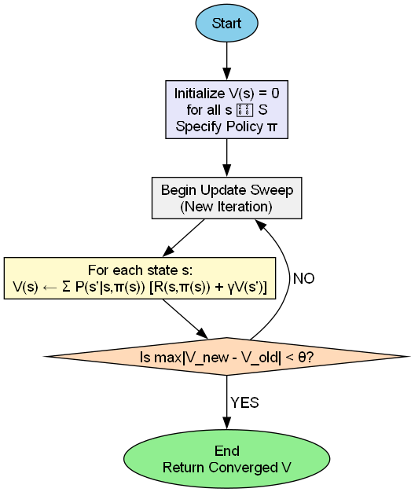
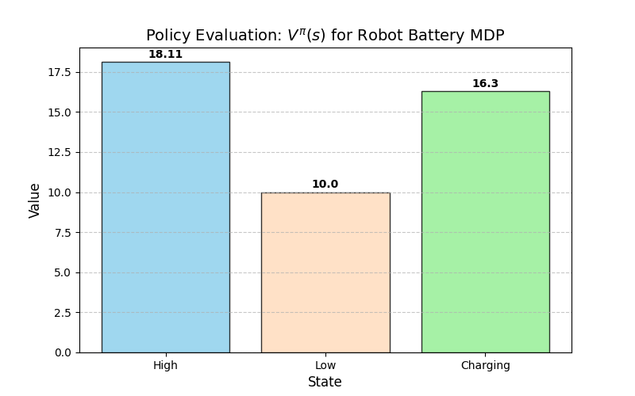
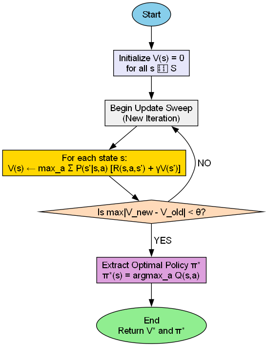
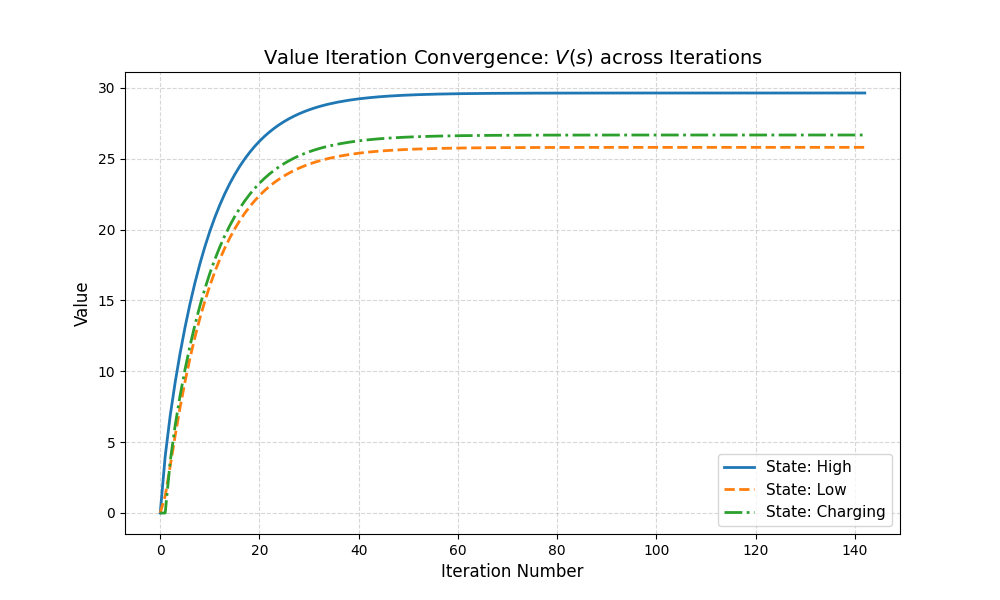
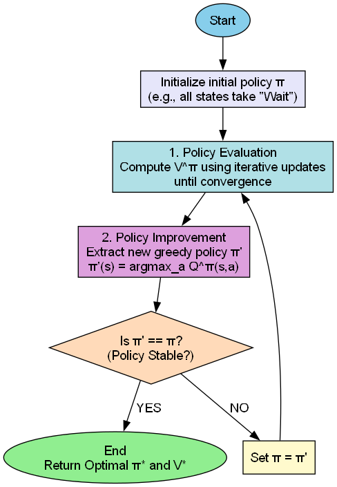
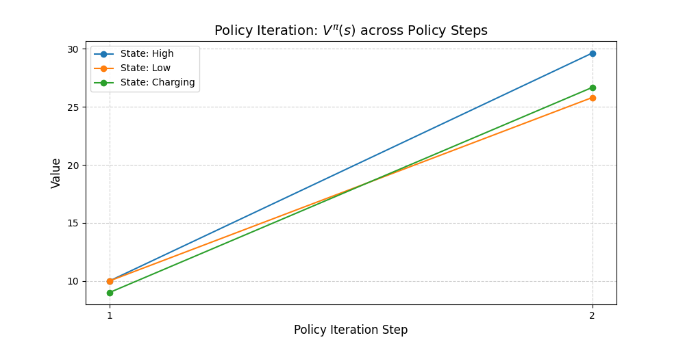
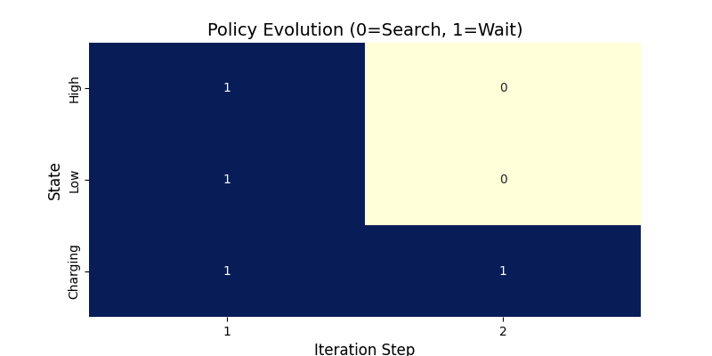

# Lab 5: MDP Algorithms - Robot Battery Management

## 1. Project Overview
This project explores the application of Markov Decision Processes (MDP) to a robot battery management problem. We implement three core algorithms—Policy Evaluation, Value Iteration, and Policy Iteration—to determine the optimal behavior for a robot that must balance search tasks with recharging.

---

## 2. Shared MDP Configuration
The MDP is defined by three states ($S$) and two actions ($A$):
- **States:** `High`, `Low`, `Charging`
- **Actions:** `Search`, `Wait`
- **Constraints:** `Search` is strictly prohibited in the `Charging` state.

### 2.1 MDP Setup and Verification
During initialization, the transition matrix $P$ and reward matrix $R$ were verified.
```text
Sum of probabilities P[s, a, :] (Should be 1.0):
  P[High, Search, :] sum = 1.00
  P[High, Wait, :] sum = 1.00
  P[Low, Search, :] sum = 1.00
  P[Low, Wait, :] sum = 1.00
  P[Charging, Search, :] sum = 1.00
  P[Charging, Wait, :] sum = 1.00

Reward Array R[s, a]:
[[  4.    1. ]
 [  1.2   1. ]
 [-10.    0. ]]
```

---

## 3. Task 1: Policy Evaluation
### 3.1 Algorithm Logic
Policy Evaluation iteratively applies the Bellman Expectation update until the state-value function $V^\pi$ converges.


### 3.2 Evaluation Results
We evaluated the fixed policy: **High → Search, Low → Wait, Charging → Wait**.
```text
Policy Evaluation converged in 84 iterations.

Converged Value Function V^pi(s):
  V^pi(High    ) = 22.1053
  V^pi(Low     ) = 21.0526
  V^pi(Charging) = 19.8947
```


---

## 4. Task 2: Value Iteration
### 4.1 Algorithm Logic
Value Iteration finds the optimal value function $V^*$ directly by taking the maximum over all available actions at each state.


### 4.2 Optimal Value Convergence
Value Iteration reached convergence in **142 iterations**.
```text
Converged Optimal Value Function V*(s):
  V*(High    ) = 29.6438
  V*(Low     ) = 25.8082
  V*(Charging) = 26.6794
```


### 4.3 Optimal Policy Extraction
The optimal policy extracted from $V^*$ is:
```text
Optimal Policy pi*(s):
  pi*(High    ) = Search
  pi*(Low     ) = Search
  pi* (Charging) = Wait
```

---

## 5. Task 3: Policy Iteration
### 5.1 Algorithm Logic
Policy Iteration alternates between Policy Evaluation (finding $V^\pi$) and Policy Improvement (updating $\pi$ greedily).


### 5.2 Rapid Convergence
Policy Iteration is highly efficient, finding the optimal policy in just **2 steps**.
```text
Iteration 1: Policy = ['Wait', 'Wait', 'Wait'], V = [10. 10.  9.]
Iteration 2: Policy = ['Search', 'Search', 'Wait'], V = [29.6438 25.8082 26.6794]
Policy Iteration converged in 2 iterations.
```



---

## 6. Bonus: Gymnasium Integration
A custom `RobotBatteryEnv` was created following the Gymnasium API. We verified that the environment's state transitions accurately reflect the analytical MDP model.
```text
Analytical vs Gymnasium Verification
State      | Analytical V*  
------------------------------
High       | 29.6438        
Low        | 25.8082        
Charging   | 26.6794        
```

---

## 7. Comparative Analysis
- **Execution Efficiency:** Policy Iteration (2 iterations) significantly outperformed Value Iteration (142 iterations) in terms of stability speed, though each PI step is computationally heavier (requires full evaluation).
- **Intuition:** The optimal strategy is "aggressive" performance. The robot searches even when low on battery because the discounted reward of potentially finding cans and returning to high power outweighs the meager +1 reward of waiting.
- **Safety:** The policy correctly identifies "Wait" in the Charging state as the only path to recovery, effectively acting as a fail-safe state.
